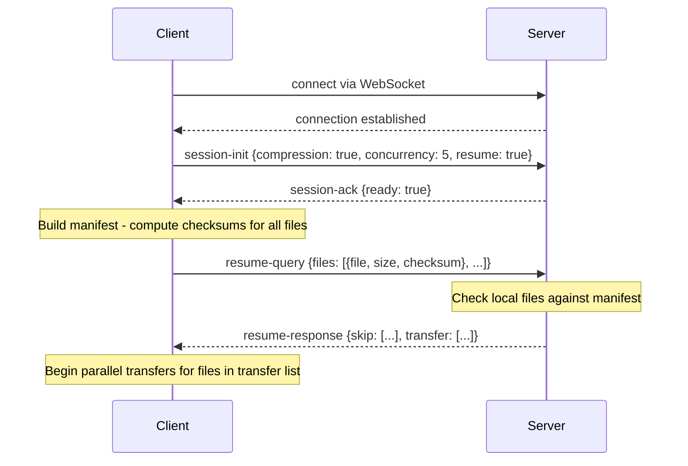
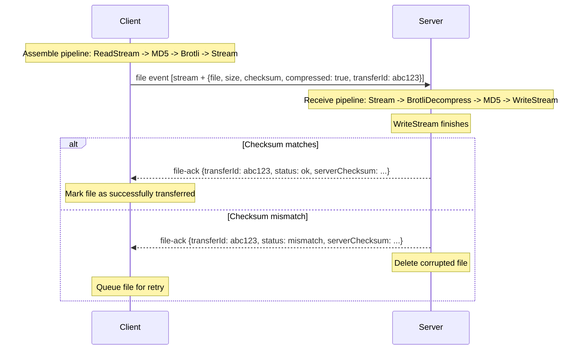
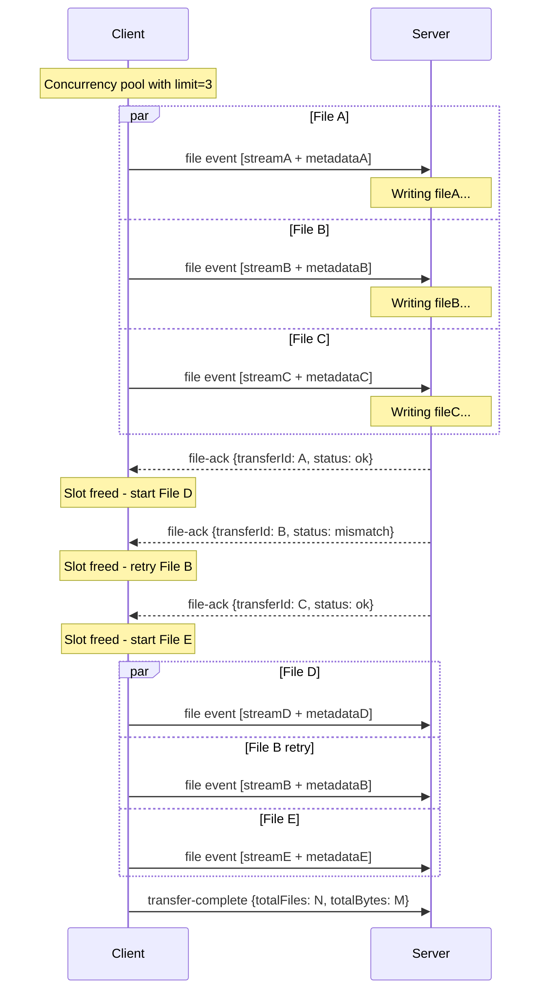
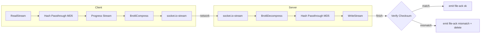

# Architecture: Parallel Sending, Checksum Verification & Brotli Compression

## 1. Overview

This document describes the architecture for three new features to the `remote-sync` CLI tool:

1. **Parallel File Sending** — configurable concurrency for simultaneous file transfers
2. **Checksum Confirmation with Retry & Resume** — integrity verification, automatic retry on failure, and resume of interrupted sessions
3. **Brotli Compression Streaming** — optional in-stream compression using Node.js built-in zlib

### Feature Interaction

All three features are designed to compose cleanly in the streaming pipeline:

```
ReadStream → [MD5 Hash (passthrough)] → [BrotliCompress] → socket.io-stream → [BrotliDecompress] → [MD5 Hash (passthrough)] → WriteStream
```

- **Parallel sending** manages *N* such pipelines concurrently
- **Checksum** is computed on **original uncompressed data** (both sides), ensuring integrity of the actual file content regardless of compression
- **Compression** is transparent to the checksum layer — the hash taps into the stream before compression (sender) and after decompression (receiver)
- **Resume** leverages checksums to skip already-transferred files

### Interaction Matrix

| Feature | Parallel | Checksum | Compression |
|---------|----------|----------|-------------|
| **Parallel** | — | Each transfer independently verifies | Each stream independently compresses |
| **Checksum** | Works per-file in parallel | — | Hash computed on uncompressed data |
| **Compression** | Each stream has own Brotli instance | Transparent to checksum | — |

---

## 2. Protocol Changes

### 2.1 New Events

| Event | Direction | Payload | Purpose |
|-------|-----------|---------|---------|
| `session-init` | Client → Server | `{ compression, concurrency, resume }` | Negotiate session capabilities |
| `session-ack` | Server → Client | `{ ready: true }` | Confirm session parameters accepted |
| `resume-query` | Client → Server | `{ files: [{ file, size, checksum }] }` | Ask server which files need transfer |
| `resume-response` | Server → Client | `{ skip: [filePath], transfer: [filePath] }` | Server responds with skip/transfer lists |
| `file` | Client → Server | stream + `{ file, size, checksum, compressed, transferId }` | Modified: now includes checksum and metadata |
| `file-ack` | Server → Client | `{ transferId, file, status, serverChecksum }` | Server confirms file integrity |
| `transfer-complete` | Client → Server | `{ totalFiles, totalBytes }` | Signal all files sent |

### 2.2 Modified Metadata for `file` Event

Current metadata:
```js
{ file: absolutePath }
```

New metadata:
```js
{
  file: absolutePath,        // unchanged
  size: number,             // file size in bytes (original, uncompressed)
  checksum: string,         // MD5 hex digest of original file
  compressed: boolean,      // whether stream is Brotli-compressed
  transferId: string        // unique ID for this transfer (for ack correlation)
}
```

### 2.3 Handshake Flow

```
Client connects → emits 'session-init' → Server responds 'session-ack'
  → (if resume) Client emits 'resume-query' → Server responds 'resume-response'
  → Client begins file transfers
```

---

## 3. Client-Side Changes

### 3.1 File: `client/index.js`

**Current flow:** Sequential `for...of` loop calling `await sendFile()`.

**New flow:**

```js
// Pseudocode for new processList
async function processList(fileList, socket, options) {
  const { concurrency, compress, compressLevel, maxRetries } = options;

  // 1. Compute checksums for all files (can be parallelized)
  const manifest = await buildManifest(fileList);

  // 2. Resume check - ask server which files to skip
  const filesToSend = await resumeCheck(socket, manifest);

  // 3. Send files with concurrency limit
  const pool = new ConcurrencyPool(concurrency);
  const results = [];

  for (const entry of filesToSend) {
    pool.add(async () => {
      let attempts = 0;
      let success = false;
      while (!success && attempts < maxRetries) {
        attempts++;
        success = await sendFileWithVerification(entry, socket, { compress, compressLevel });
        if (!success) console.warn(`Retry ${attempts}/${maxRetries}: ${entry.file}`);
      }
      results.push({ file: entry.file, success, attempts });
    });
  }

  await pool.drain();
  socket.emit('transfer-complete', { totalFiles: results.length });
  printSummary(results);
  process.exit(0);
}
```

### 3.2 New `sendFileWithVerification` Function

Replaces current `sendFile`. Key differences:

1. Generates a `transferId` (e.g., `crypto.randomUUID()`)
2. Computes MD5 checksum via a passthrough hash stream
3. Optionally pipes through `zlib.createBrotliCompress()`
4. Waits for `file-ack` event from server before resolving
5. Returns `true` on checksum match, `false` on mismatch

### 3.3 Streaming Pipeline (Client)

```
fs.createReadStream(file)
  → crypto hash (passthrough, computes MD5)
  → progress-stream (for reporting)
  → [optional: zlib.createBrotliCompress()]
  → socket.io-stream
```

### 3.4 Progress Reporting for Parallel Transfers

- Each active transfer maintains its own progress state
- A `ProgressReporter` class manages multi-line terminal output
- Uses ANSI escape codes to update multiple lines in-place
- Falls back to single-line rolling output if terminal does not support multi-line

---

## 4. Server-Side Changes

### 4.1 File: `server/index.js`

**New responsibilities:**

1. Handle `session-init` — store session parameters
2. Handle `resume-query` — scan local files, compute checksums, respond with skip/transfer lists
3. Handle `file` events with new metadata — decompress if needed, compute checksum, send `file-ack`
4. Support multiple simultaneous writes (already works with current architecture since each `file` event creates an independent WriteStream)

### 4.2 Receiving Pipeline (Server)

```
socket.io-stream (incoming)
  → [optional: zlib.createBrotliDecompress()]
  → crypto hash (passthrough, computes MD5)
  → fs.createWriteStream(file)
```

On WriteStream `finish` event:
1. Get final MD5 digest from hash
2. Compare with `fileData.checksum` from metadata
3. Emit `file-ack` with match/mismatch status
4. On mismatch: delete the corrupted file

### 4.3 Resume Query Handler

```js
socket.on('resume-query', async ({ files }) => {
  const skip = [];
  const transfer = [];

  for (const { file, size, checksum } of files) {
    if (fs.existsSync(file)) {
      const localChecksum = await computeFileChecksum(file);
      const localSize = fs.statSync(file).size;
      if (localChecksum === checksum && localSize === size) {
        skip.push(file);
        continue;
      }
    }
    transfer.push(file);
  }

  socket.emit('resume-response', { skip, transfer });
});
```

---

## 5. New CLI Options

### `send` Command

| Flag | Description | Default |
|------|-------------|---------|
| `-c, --concurrency <number>` | Number of parallel file transfers | `5` |
| `-z, --compress` | Enable Brotli compression | `false` |
| `--compress-level <number>` | Brotli quality level (1-11) | `3` |
| `--no-checksum` | Disable checksum verification | checksum enabled |
| `--retries <number>` | Max retry attempts on checksum mismatch | `3` |
| `--resume` | Resume a previous interrupted transfer | `false` |

### `receive` Command

| Flag | Description | Default |
|------|-------------|---------|
| `-p, --port <number>` | Server listening port | `8000` |
| `-o, --output <folder>` | Output directory (override received paths) | *use sender paths* |

### Updated `index.js` Example

```js
program.command('send')
  .description('copy folder to receiver')
  .option('-a, --address <ip>', 'ip address', '127.0.0.1')
  .option('-f, --folder <folder>', 'Folder to send', process.cwd())
  .option('-c, --concurrency <number>', 'parallel transfers', '5')
  .option('-z, --compress', 'enable Brotli compression', false)
  .option('--compress-level <number>', 'Brotli quality (1-11)', '3')
  .option('--no-checksum', 'disable checksum verification')
  .option('--retries <number>', 'max retries on failure', '3')
  .option('--resume', 'resume interrupted transfer', false)
  .action((opt) => { /* ... */ });
```

---

## 6. New Dependencies

| Package | Purpose | Built-in? |
|---------|---------|-----------|
| `crypto` | MD5 hashing via `crypto.createHash('md5')` | ✅ Yes |
| `zlib` | `createBrotliCompress()` / `createBrotliDecompress()` | ✅ Yes |
| `stream` | `PassThrough`, `pipeline()` | ✅ Yes |
| `p-limit` | Concurrency pool for parallel transfers | ❌ No (npm) |

**Rationale for `p-limit`:** While a custom concurrency limiter could be written, `p-limit` is a zero-dependency, well-tested 50-line module. Alternatively, a custom implementation in `common/concurrency.js` avoids any new dependency.

**Rationale for MD5:** For integrity checking on a LAN (not security), MD5 is the fastest built-in hash in Node.js. SHA-256 is ~2x slower. XXHash would be faster but requires a native/WASM dependency (`xxhash-wasm`). MD5 provides the best balance of speed and zero-dependency for this use case.

**No new npm dependencies are strictly required** — all features can be implemented with Node.js built-in modules plus a ~30 line concurrency helper.

---

## 7. File Structure Changes

```
remote-sync/
├── index.js                    # Modified: new CLI options
├── package.json                # Modified: version bump
├── ARCHITECTURE.md             # New: this document
├── client/
│   ├── index.js                # Modified: orchestration with concurrency + resume
│   ├── sender.js               # New: single-file send with checksum + compression
│   └── progress.js             # New: multi-transfer progress reporter
├── server/
│   ├── index.js                # Modified: session handling, ack events
│   └── receiver.js             # New: single-file receive with checksum + decompression
├── common/
│   ├── files.js                # Unchanged
│   ├── checksum.js             # New: MD5 hash computation (file + stream)
│   ├── compression.js          # New: Brotli stream factory
│   └── concurrency.js          # New: promise concurrency pool (replaces p-limit)
└── plans/
    └── ...
```

### New Module Descriptions

| Module | Exports | Responsibility |
|--------|---------|---------------|
| `common/checksum.js` | `computeFileChecksum(filePath)`, `createHashPassthrough()` | Compute MD5 of file or create a passthrough stream that computes hash |
| `common/compression.js` | `createCompressor(level)`, `createDecompressor()` | Factory for Brotli compress/decompress transform streams |
| `common/concurrency.js` | `ConcurrencyPool` class | Limits concurrent async operations to N |
| `client/sender.js` | `sendFile(entry, socket, options)` | Handles single file: pipeline assembly, checksum, ack waiting |
| `client/progress.js` | `ProgressReporter` class | Manages multi-line progress display for concurrent transfers |
| `server/receiver.js` | `receiveFile(stream, fileData, socket)` | Handles single file: pipeline assembly, checksum verification, ack emission |

---

## 8. Sequence Diagrams

### 8.1 Session Initialization with Resume



### 8.2 Single File Transfer with Checksum and Compression



### 8.3 Parallel Transfer Flow



### 8.4 Complete Pipeline Detail



---

## 9. Edge Cases and Error Handling

### 9.1 Network & Connection

| Scenario | Handling |
|----------|----------|
| Connection drops mid-transfer | Client detects disconnect, aborts in-flight transfers, logs which files were incomplete. On reconnect with `--resume`, skips completed files. |
| Server not reachable | Client retries connection 3 times with exponential backoff, then exits with error |
| Socket timeout during large file | Increase Socket.IO `pingTimeout` to 120s for large transfers |

### 9.2 Checksum & Integrity

| Scenario | Handling |
|----------|----------|
| Checksum mismatch | Server deletes partial/corrupted file, sends `mismatch` ack, client retries up to `--retries` times |
| All retries exhausted | Log the file as failed, continue with other files, report in final summary |
| File changes during checksum computation | Use file size + mtime check; if file changes between hash and send, recompute |
| Empty file (0 bytes) | Still compute checksum (MD5 of empty = d41d8cd98f00b204e9800998ecf8427e), still verify |

### 9.3 Compression

| Scenario | Handling |
|----------|----------|
| Already-compressed files (zip, jpg, mp4) | Still apply Brotli at quality 1 — minimal overhead, consistent pipeline. Future: skip compression for known compressed extensions |
| Brotli stream error | Catch error on transform stream, treat as transfer failure, retry without compression on that file |
| Server receives uncompressed when expecting compressed | `compressed` flag in metadata tells server whether to decompress; mismatch in flag = protocol error, reject transfer |

### 9.4 Parallel Transfers

| Scenario | Handling |
|----------|----------|
| One file blocks others (very large file) | Each file is independent; other slots continue. Large files do not block small ones. |
| Too many concurrent streams overwhelm network | Default concurrency of 5 is conservative for LAN. User can reduce with `-c 1` for constrained networks. |
| Memory pressure from many concurrent reads | Each ReadStream uses default 64KB highWaterMark. At concurrency 5, thats ~320KB read buffer — negligible. |
| File not found (deleted between scan and send) | Catch ENOENT, log warning, skip file, do not retry |
| Permission denied on server write | Server sends `file-ack` with `status: error` and `reason`, client logs and skips |

### 9.5 Resume

| Scenario | Handling |
|----------|----------|
| Partially written file on server | `resume-query` compares checksum — partial file will have wrong checksum, so it gets re-transferred |
| File modified on sender since last attempt | New checksum wont match server copy, so file gets re-transferred |
| Thousands of files in resume-query | Batch the manifest in chunks of 500 files to avoid oversized messages |
| Server has file with correct size but wrong checksum | Checksum takes priority — file is re-transferred |

---

## 10. Recommended Defaults

| Setting | Default | Rationale |
|---------|---------|-----------|
| Concurrency | `5` | Balances throughput vs resource usage on WiFi. Gigabit LAN could handle 10+, but 5 is safe for all LAN types |
| Compression | `disabled` | On Gigabit LAN, compression adds CPU cost without bandwidth savings. Useful for slower WiFi or large text files |
| Brotli quality | `3` | Quality 1-4 is the fast range. 3 gives ~2x compression on text with minimal CPU. Quality 0 is too low ratio, 4+ gets diminishing returns |
| Checksum | `enabled` | Integrity verification is critical; MD5 overhead is <5% on modern CPUs |
| Max retries | `3` | On LAN, corruption is rare; 3 retries is more than sufficient |
| Resume | `disabled` | Must be explicitly opted-in since it requires server-side checksum computation of existing files which can be slow for large directories |
| Hash algorithm | `MD5` | Fastest built-in Node.js hash. Not used for security, only integrity. ~800 MB/s throughput on modern hardware |
| Socket.IO pingTimeout | `120000` (ms) | Large files may cause apparent inactivity; 2 minutes prevents false disconnects |
| Socket.IO maxHttpBufferSize | `1e8` (100MB) | Allows large metadata payloads for resume manifests with many files |

---

## Appendix A: `common/checksum.js` Interface

```js
const crypto = require('crypto');
const fs = require('fs');
const { pipeline } = require('stream/promises');

/**
 * Compute MD5 checksum of a file on disk.
 * @param {string} filePath - Absolute path to file
 * @returns {Promise<string>} Hex-encoded MD5 digest
 */
async function computeFileChecksum(filePath) {
  const hash = crypto.createHash('md5');
  const stream = fs.createReadStream(filePath);
  await pipeline(stream, hash);
  return hash.digest('hex');
}

/**
 * Create a passthrough transform that computes MD5 on flowing data.
 * Call .digest('hex') on the returned object after stream ends.
 * @returns {{ stream: Transform, getDigest: () => string }}
 */
function createHashPassthrough() {
  const hash = crypto.createHash('md5');
  const { PassThrough } = require('stream');
  const pt = new PassThrough();
  pt.on('data', (chunk) => hash.update(chunk));
  return {
    stream: pt,
    getDigest: () => hash.digest('hex')
  };
}

module.exports = { computeFileChecksum, createHashPassthrough };
```

## Appendix B: `common/compression.js` Interface

```js
const zlib = require('zlib');

/**
 * Create a Brotli compression transform stream.
 * @param {number} level - Brotli quality (1-11), default 3
 * @returns {Transform}
 */
function createCompressor(level = 3) {
  return zlib.createBrotliCompress({
    params: {
      [zlib.constants.BROTLI_PARAM_QUALITY]: level
    }
  });
}

/**
 * Create a Brotli decompression transform stream.
 * @returns {Transform}
 */
function createDecompressor() {
  return zlib.createBrotliDecompress();
}

module.exports = { createCompressor, createDecompressor };
```

## Appendix C: `common/concurrency.js` Interface

```js
/**
 * A simple concurrency pool that limits parallel async operations.
 * Zero dependencies — replaces p-limit.
 */
class ConcurrencyPool {
  constructor(limit) {
    this.limit = limit;
    this.active = 0;
    this.queue = [];
  }

  add(fn) {
    return new Promise((resolve, reject) => {
      this.queue.push({ fn, resolve, reject });
      this._next();
    });
  }

  _next() {
    while (this.active < this.limit && this.queue.length > 0) {
      const { fn, resolve, reject } = this.queue.shift();
      this.active++;
      fn()
        .then(resolve)
        .catch(reject)
        .finally(() => {
          this.active--;
          this._next();
        });
    }
  }

  async drain() {
    // Wait until all queued tasks are complete
    if (this.queue.length === 0 && this.active === 0) return;
    return new Promise((resolve) => {
      const check = setInterval(() => {
        if (this.queue.length === 0 && this.active === 0) {
          clearInterval(check);
          resolve();
        }
      }, 50);
    });
  }
}

module.exports = { ConcurrencyPool };
```

---

## Implementation Priority

The recommended implementation order:

1. **`common/` modules first** — checksum, compression, concurrency (independent, testable)
2. **Protocol layer** — session-init/ack, file-ack events
3. **Checksum feature** — sender computes + sends, server verifies + acks
4. **Compression feature** — add to pipeline (transparent to checksum)
5. **Parallel sending** — replace sequential loop with concurrency pool
6. **Resume** — requires checksum to be working first
7. **CLI options** — wire everything together through Commander.js
8. **Progress reporting** — multi-line display for parallel transfers
