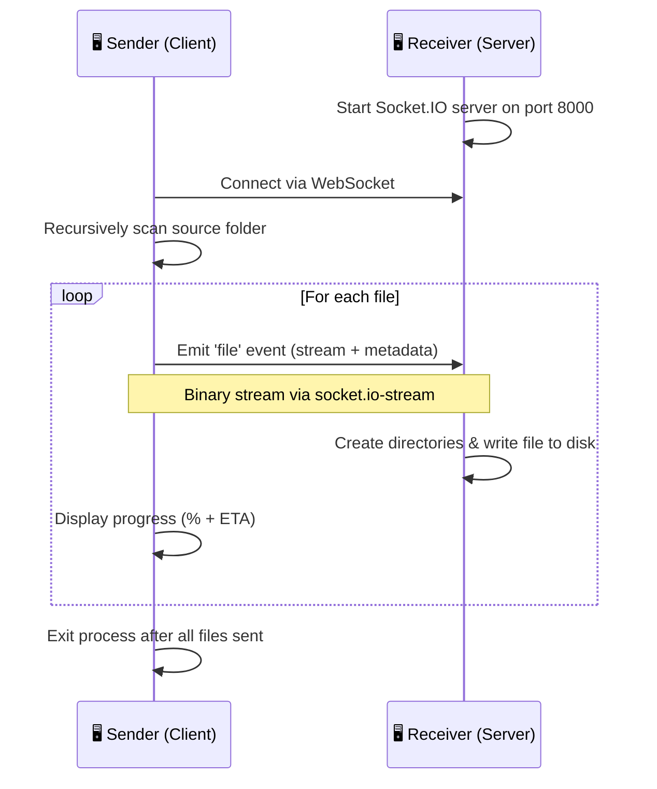

# remote-copy


A CLI tool for transferring entire folder structures between computers over a local network using WebSockets and streams. One machine acts as the **receiver** (server) and another as the **sender** (client). Files are streamed preserving their original directory structure.

---

## ✨ Features

- 📁 Recursively transfers entire directory structures
- 🌐 Works over local network via WebSockets (Socket.IO v4)
- 📊 Real-time progress display with percentage and ETA
- 🔄 Stream-based transfer — no need to load entire files into memory
- 🏗️ Automatically creates directory structure on the receiver
- 💻 Simple CLI interface powered by Commander.js
- ⚡ Zero configuration required for basic usage

---

## 🏛️ Architecture



### Communication Protocol

| Property | Value |
|----------|-------|
| Transport | WebSocket via Socket.IO v4 |
| Streaming | `socket.io-stream` for binary file transfer |
| Port | `8000` (hardcoded) |
| Event | `'file'` — carries binary stream + metadata `{ file: string }` |
| Transfer mode | Sequential (file-by-file) |

---

## 📋 Prerequisites

- **Node.js** (v14+ recommended, uses CommonJS modules and ES2021 features)
- **npm** for dependency installation
- **Port 8000** must be open/unblocked on the receiver's firewall
- **Administrator/elevated privileges** on both machines (files are written using absolute paths)
- Both machines must be on the **same local network**

---

## 📦 Installation

```bash
# Clone the repository
git clone <repository-url>
cd remote-copy

# Install dependencies globally
npm install -g .
```

After global installation, the `remote-copy` command will be available system-wide.

### Local Development

```bash
# Clone and install dependencies
git clone <repository-url>
cd remote-copy
npm install

# Run locally with node
node index.js <command> [options]
```

---

## 🚀 Usage

### Receiver (Target Machine)

Start the receiver server on the machine where you want files to be written:

```bash
remote-copy receive
```

> ⚠️ **Important:**
> - Run as **Administrator** (Windows) or with **sudo** (Linux/macOS)
> - Ensure **port 8000** is not blocked by your firewall

### Sender (Source Machine)

Send a folder to the receiver machine:

```bash
# Send current directory to receiver at specific IP
remote-copy send -a 192.168.1.100

# Send a specific folder
remote-copy send -a 192.168.1.100 -f /path/to/folder

# Send to localhost (default, for testing)
remote-copy send -f ./my-project
```

### Example Workflow

```bash
# On Machine A (receiver) — IP: 192.168.1.50
remote-copy receive
# Output: Server listening on port 8000...

# On Machine B (sender)
remote-copy send -a 192.168.1.50 -f ./documents
# Output: Sending file 1/42 ... 45% | ETA: 12s
```

---

## ⚙️ Configuration

| Option | Flag | Default | Description |
|--------|------|---------|-------------|
| Server address | `-a, --address <ip>` | `127.0.0.1` | IP address of the receiver machine |
| Source folder | `-f, --folder <folder>` | Current working directory | Folder to transfer |
| Port | N/A | `8000` (hardcoded) | Not configurable via CLI |

---

## 🔧 How It Works

### Technical Deep-Dive

1. **Receiver initialization** — The `receive` command starts a Socket.IO server bound to port 8000. It listens for incoming `'file'` events on each client connection.

2. **Sender connection** — The `send` command connects to the receiver's IP via `socket.io-client`. Once connected, it begins scanning the source folder.

3. **Directory scanning** — The `common/files.js` utility recursively walks the specified folder, collecting all file paths (excluding `node_modules`).

4. **File streaming** — For each file, the sender:
   - Creates a read stream from the file
   - Pipes it through `progress-stream` to track transfer progress
   - Emits a `'file'` event via `socket.io-stream` with the stream and metadata containing the file's path

5. **File writing** — The receiver:
   - Extracts the file path from the metadata
   - Recursively creates any necessary parent directories
   - Creates a write stream and pipes the incoming data to disk

6. **Progress reporting** — The sender displays real-time progress (percentage and ETA) for each file being transferred via stdout.

7. **Completion** — After all files have been streamed, the sender process exits.


---

## 📂 Project Structure

```
remote-copy/
├── index.js             # CLI entry point — defines commands using Commander.js
├── client/
│   └── index.js         # Sender logic — connects to server, scans folder, streams files
├── server/
│   └── index.js         # Receiver logic — listens for connections, writes files to disk
├── common/
│   └── files.js         # Shared utility — recursive directory scanner (excludes node_modules)
├── package.json         # Project metadata, dependencies, and bin configuration
├── package-lock.json    # Locked dependency tree
├── .eslintrc.js         # ESLint configuration (standard style)
├── .gitignore           # Git ignore rules
└── README.md            # This file
```

### Dependencies

| Package | Version | Purpose |
|---------|---------|---------|
| `commander` | ^9.0.0 | CLI argument parsing and command definitions |
| `progress-stream` | ^2.0.0 | Track upload progress (percentage, ETA, speed) |
| `socket.io` | ^4.4.1 | WebSocket server implementation |
| `socket.io-client` | ^4.4.1 | WebSocket client implementation |
| `socket.io-stream` | ^0.9.1 | Binary streaming over Socket.IO connections |

### Dev Dependencies

| Package | Purpose |
|---------|---------|
| `eslint` | Code linting |
| `eslint-config-standard` | Standard JS style rules |

---

## ⚠️ Known Limitations

| # | Limitation | Impact |
|---|-----------|--------|
| 1 | **Absolute path transfer** | Files are written using the sender's absolute paths. Cross-platform transfers (e.g., Linux → Windows) may have path resolution issues. |
| 2 | **No authentication or encryption** | Anyone on the network can connect and send files to the receiver. Not suitable for untrusted networks. |
| 3 | **No resume capability** | If a transfer is interrupted, it must be restarted from scratch. |
| 4 | **Sequential transfer** | Files are sent one at a time, not in parallel. Large transfers with many small files may be slow. |
| 5 | **Port not configurable** | Hardcoded to port 8000 in both client and server. |
| 6 | **Empty directories not preserved** | Only files are transferred; empty directories won't be created on the receiver. |
| 7 | **No integrity verification** | No checksum or hash validation after transfer. |

---

## 🤝 Contributing

Contributions are welcome! Here's how to get started:

1. **Fork** the repository
2. **Create** a feature branch (`git checkout -b feature/my-feature`)
3. **Install** dependencies (`npm install`)
4. **Make** your changes
5. **Lint** your code (`npx eslint .`)
6. **Commit** with a descriptive message (`git commit -m "feat: add port configuration"`)
7. **Push** to your branch (`git push origin feature/my-feature`)
8. **Open** a Pull Request

### Suggested Improvements

- [ ] Make port configurable via CLI flag
- [ ] Add authentication/encryption (TLS + token)
- [ ] Support parallel file transfers
- [ ] Add transfer resume capability
- [ ] Implement checksum verification
- [ ] Use relative paths for cross-platform compatibility
- [ ] Add `--exclude` patterns option
- [ ] Add compression support (gzip/zstd)

---

## 📄 License

This project is licensed under the **ISC License** — see the [package.json](package.json) for details.

---

<p align="center">
  <i>Built for fast local network file transfers between development machines.</i>
</p>
