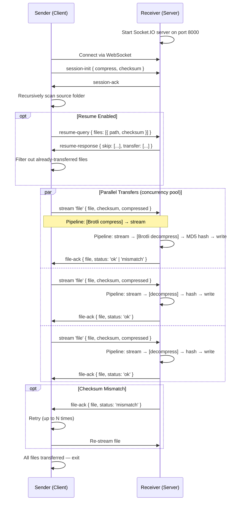

# remote-sync


A high-performance CLI tool for transferring entire folder structures between computers over a local network. Built on WebSockets and streams, it supports **parallel file transfers**, **Brotli compression**, and **checksum verification with automatic retry and resume** — ensuring fast, reliable, and resumable directory synchronization.

---

## Features

- **Parallel file transfers** — configurable concurrency (default: 5 simultaneous streams)
- **Brotli compression** — optional streaming compression using Node.js built-in `zlib` (quality 3, optimized for LAN speed)
- **MD5 checksum verification** — integrity check on every file with automatic retry on mismatch
- **Resume capability** — skips files already present on the server with matching checksums
- Recursively transfers entire directory structures preserving hierarchy
- Works over local network via WebSockets (Socket.IO v4)
- Real-time progress display with percentage and ETA
- Stream-based transfer — no need to load entire files into memory
- Automatically creates directory structure on the receiver
- Simple CLI interface powered by Commander.js
- Zero configuration required for basic usage
- No additional npm dependencies — new modules use only Node.js built-ins (`crypto`, `zlib`, `stream`)

---

## Prerequisites

- **Node.js** v14+ (uses CommonJS modules, `zlib` Brotli support, and `crypto` for MD5)
- **npm** for dependency installation
- **Port 8000** must be open/unblocked on the receiver's firewall
- Both machines must be on the **same local network**

---

## Installation

```bash
# Clone the repository
git clone <repository-url>
cd remote-sync

# Install dependencies globally
npm install -g .
```

After global installation, the `remote-sync` command will be available system-wide.

### Local Development

```bash
# Clone and install dependencies
git clone <repository-url>
cd remote-sync
npm install

# Run locally with node
node index.js <command> [options]
```

---

## Usage

### Receiver (Target Machine)

Start the receiver server on the machine where you want files to be written:

```bash
remote-sync receive
```

The server listens on port **8000** and waits for incoming connections.

### Sender (Source Machine)

Send the current directory to the receiver:

```bash
remote-sync send -a 192.168.1.100
```

Send a specific folder with all new features enabled:

```bash
remote-sync send -a 192.168.1.100 -f ./my-project -z -c 10
```

### Examples

#### Basic transfer (parallel, with checksum)

```bash
# Default: 5 parallel transfers, checksum enabled, resume enabled
remote-sync send -a 192.168.1.50 -f /path/to/folder
```

#### Maximum speed on fast LAN (compression + high concurrency)

```bash
remote-sync send -a 192.168.1.50 -f ./large-project -z -c 20
```

#### Disable checksum for maximum throughput (trusted network)

```bash
remote-sync send -a 192.168.1.50 -f ./data --no-checksum
```

#### Resume an interrupted transfer

```bash
# Simply re-run the same command — files already transferred are skipped
remote-sync send -a 192.168.1.50 -f ./large-backup
```

#### Disable resume (force re-transfer all files)

```bash
remote-sync send -a 192.168.1.50 -f ./folder --no-resume
```

#### Increase retries for unreliable connections

```bash
remote-sync send -a 192.168.1.50 -f ./critical-data -r 5
```

---

## Configuration

### Commands

| Command   | Description                        |
|-----------|------------------------------------|
| `receive` | Start a server to receive data     |
| `send`    | Copy folder recursively to receiver |

### Send Options

| Flag | Long Form | Default | Description |
|------|-----------|---------|-------------|
| `-a` | `--address <ip>` | `127.0.0.1` | IP address of the receiver |
| `-f` | `--folder <folder>` | Current directory | Folder to copy |
| `-c` | `--concurrency <number>` | `5` | Number of parallel file transfers |
| `-z` | `--compress` | Disabled | Enable Brotli compression (quality 3) |
| | `--no-checksum` | Enabled | Disable MD5 checksum verification |
| `-r` | `--retries <number>` | `3` | Maximum retries per file on checksum mismatch |
| | `--no-resume` | Enabled | Disable resume capability (re-transfer all files) |

### Full CLI Reference

```
Usage: remote-sync [options] [command]

Options:
  -V, --version          output the version number
  -h, --help             display help for command

Commands:
  receive                start a server to receive data
  send [options]         copy folder recursively to receiver

Send options:
  -a, --address <ip>         IP address of the receiver (default: "127.0.0.1")
  -f, --folder <folder>      folder to copy (default: current directory)
  -c, --concurrency <number> parallel file transfers (default: "5")
  -z, --compress             enable Brotli compression
  --no-checksum              disable MD5 checksum verification
  -r, --retries <number>     max retries per file (default: "3")
  --no-resume                disable resume capability
```

---

## How It Works

### Protocol Overview

The transfer protocol operates over WebSocket (Socket.IO v4) on port 8000 with the following phases:

1. **Session Initialization** — Client connects and emits `session-init` with capabilities (`{ compress, checksum }`)
2. **Resume Negotiation** — Client sends file manifest via `resume-query`; server responds with skip/transfer lists
3. **Parallel Transfer** — Files are streamed concurrently through `socket.io-stream` with metadata
4. **Verification** — Server rebuilds each file through a pipeline (decompress → hash → write), verifies checksum
5. **Acknowledgment** — Server emits `file-ack` per file; client retries on mismatch

### Sequence Diagram



### Transfer Pipeline

```
Sender:                                           Receiver:
┌──────────┐    ┌────────┐    ┌──────────┐      ┌────────────┐    ┌────────┐    ┌───────┐
│ Read File │───▶│ MD5    │───▶│ Brotli   │─────▶│ Brotli     │───▶│ MD5    │───▶│ Write │
│ Stream    │    │ Hash   │    │ Compress │      │ Decompress │    │ Verify │    │ File  │
└──────────┘    └────────┘    └──────────┘      └────────────┘    └────────┘    └───────┘
                                    │                                    │
                                WebSocket Stream (socket.io-stream)
```

### Communication Protocol

| Property | Value |
|----------|-------|
| Transport | WebSocket via Socket.IO v4 |
| Streaming | `socket.io-stream` for binary file transfer |
| Port | `8000` (hardcoded) |
| Events | `session-init`, `session-ack`, `resume-query`, `resume-response`, `file`, `file-ack` |
| Transfer mode | Parallel (configurable concurrency pool) |
| Compression | Brotli (quality 3, optional) |
| Integrity | MD5 checksum on uncompressed data |

---

## Project Structure

```
remote-sync/
├── index.js              # CLI entry point (Commander.js)
├── client/
│   └── index.js          # Sender - parallel streaming with compression/checksum
├── server/
│   └── index.js          # Receiver - decompression, verification, resume protocol
├── common/
│   ├── files.js          # Recursive directory scanner
│   ├── checksum.js       # MD5 hash utilities (file + stream)
│   ├── compression.js    # Brotli compress/decompress stream factories
│   └── concurrency.js    # ConcurrencyPool for parallel task limiting
├── package.json          # Project metadata and dependencies
├── package-lock.json     # Locked dependency versions
├── ARCHITECTURE.md       # Detailed architecture documentation
├── README.md             # This file
├── .eslintrc.js          # ESLint configuration
└── .gitignore            # Git ignore rules
```

### Module Responsibilities

| Module | Purpose |
|--------|---------|
| `index.js` | CLI definition and command routing via Commander.js |
| `client/index.js` | Orchestrates parallel file sending with compression, checksums, and retry logic |
| `server/index.js` | Handles incoming streams, decompression, verification, and resume responses |
| `common/files.js` | Recursively scans directories and returns file paths |
| `common/checksum.js` | MD5 hash computation for files and streams |
| `common/compression.js` | Brotli compress/decompress transform stream factories |
| `common/concurrency.js` | ConcurrencyPool class for limiting parallel async operations |

---

## Architecture

For a detailed breakdown of the system architecture, data flow, and design decisions, see [ARCHITECTURE.md](ARCHITECTURE.md).

Key architectural highlights:

- **Streaming-first design** — Files are never fully buffered in memory
- **Concurrency pool** — A custom `ConcurrencyPool` limits simultaneous transfers without overwhelming the network
- **Pipeline composition** — Each file transfer is a composable pipeline of transform streams (read → hash → compress → network → decompress → verify → write)
- **Stateless resume** — Resume is negotiated per-session using checksums, requiring no persistent state files

---

## Dependencies

### Runtime Dependencies

| Package | Purpose |
|---------|---------|
| `commander` | CLI argument parsing |
| `socket.io` | WebSocket server |
| `socket.io-client` | WebSocket client |
| `socket.io-stream` | Binary streaming over Socket.IO |
| `progress-stream` | Transfer progress reporting |

### Node.js Built-ins Used (no additional packages)

| Module | Purpose |
|--------|---------|
| `crypto` | MD5 checksum computation |
| `zlib` | Brotli compression/decompression |
| `stream` | Transform stream utilities |
| `fs` | File system operations |
| `path` | Path manipulation |

### Dev Dependencies

| Package | Purpose |
|---------|---------|
| `eslint` | Code linting |
| `eslint-config-standard` | Standard style rules |

---

## Known Limitations

- **Port 8000 is hardcoded** — Cannot be configured via CLI (planned for future release)
- **No encryption** — Data is transferred in plaintext; use only on trusted networks
- **No authentication** — Any client on the network can connect to the receiver
- **No file deletion sync** — Only transfers files; does not remove files deleted on sender
- **Large file count** — Resume query sends full manifest over WebSocket; extremely large file trees (100k+ files) may experience initial delay
- **No bandwidth throttling** — Uses all available network bandwidth

---

## Contributing

Contributions are welcome! Please follow these steps:

1. Fork the repository
2. Create a feature branch (`git checkout -b feature/amazing-feature`)
3. Ensure code passes linting: `npx eslint .`
4. Commit your changes (`git commit -m 'Add amazing feature'`)
5. Push to the branch (`git push origin feature/amazing-feature`)
6. Open a Pull Request

### Code Style

This project uses ESLint with the Standard configuration. Run the linter before submitting:

```bash
npx eslint . --fix
```

---

## License

This project is licensed under the **ISC License**. See the [package.json](package.json) for details.
